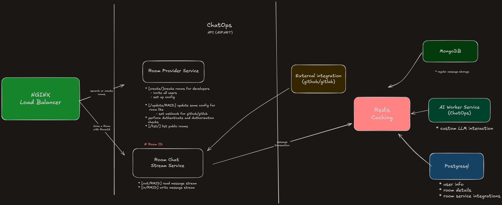

## ChatOps
ChatOps is an open-source, developer-first communication platform designed to keep engineering teams seamlessly connected and aligned on project lifecycles.

## The Problem
Managing a modern software project involves too many moving pieces—from tracking failing CI/CD pipelines and pull requests to monitoring new production releases. When development teams resort to generic messaging platforms like WhatsApp, they lose out on crucial context because these apps lack native developer tool integrations. On the other hand, corporate platforms like Slack offer these integrations but quickly become cost-prohibitive for independent teams, startups, and group projects.

The Solution
ChatOps bridges this gap by offering a fully integrated, scalable development ecosystem that brings your tools directly into your chat rooms. By providing a free, self-hosted infrastructure, ChatOps ensures your team stays updated on automated workflows without platform limitations or subscription fees.

## Core Features
` Real-Time Collaboration `: Persistent chat rooms powered by WebSockets for instant team communication.

`DevOps Ecosystem Integrations`: Native incoming webhook support to stream events directly from GitHub and GitLab (e.g., Pull Requests, Issues, Actions, and Pipeline statuses).

`Asynchronous AI Companion`: A dedicated background AI worker to assist developers with debugging, code summaries, and tasks without impacting chat latency.

`Scalable Architecture`: Built with an ASP.NET core API, protected by an NGINX load balancer, using Redis Pub/Sub as a high-performance backplane.

## Architecture & Planning

The platform is split into specialized decoupled microservices to handle high-concurrency traffic and asynchronous processing:

### Storage & Infrastructure Breakdown
* PostgreSQL: Handles relational data including user management, room configurations, authentication, and integration metadata.

* Redis: Serves as a fast caching layer and acts as the real-time messaging backplane to sync WebSocket streams across scaled server instances.

* MongoDB: Acts as the persistent, append-only document store for historical chat logs, webhook payloads, and AI interaction archives.
